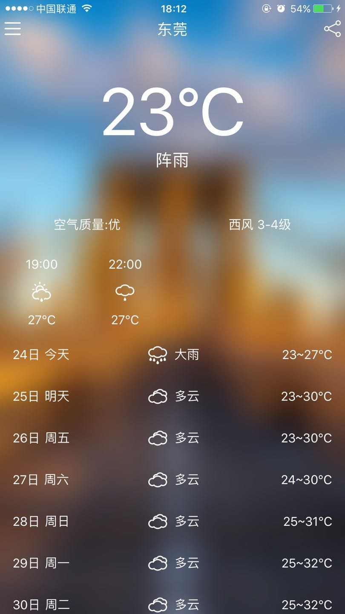
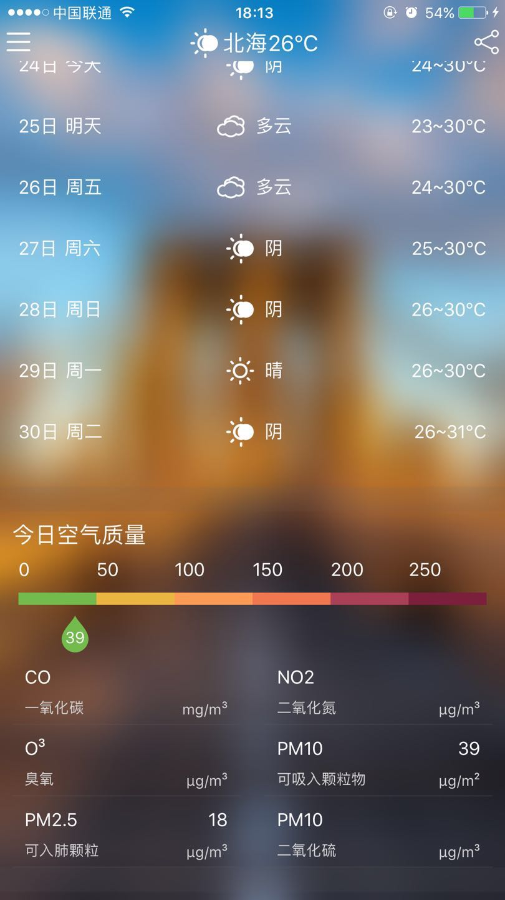
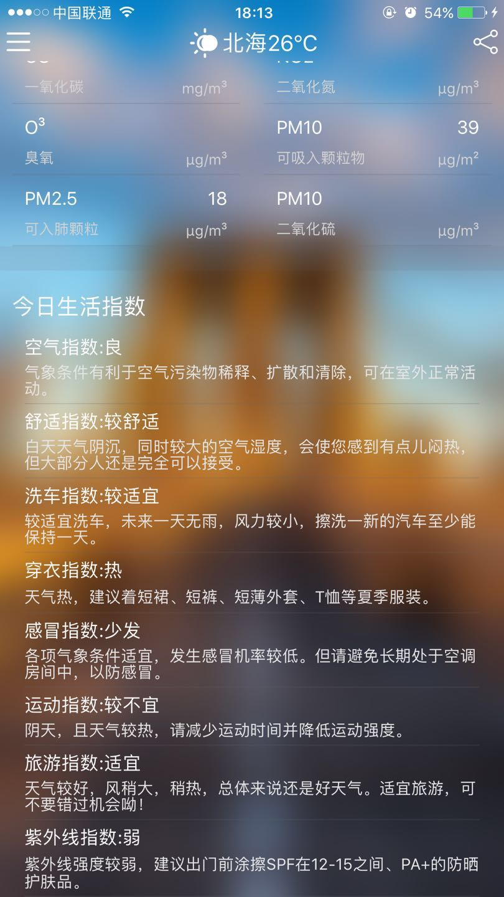
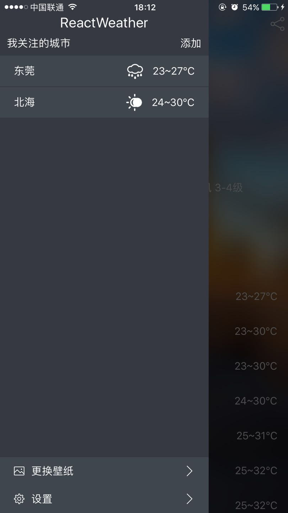
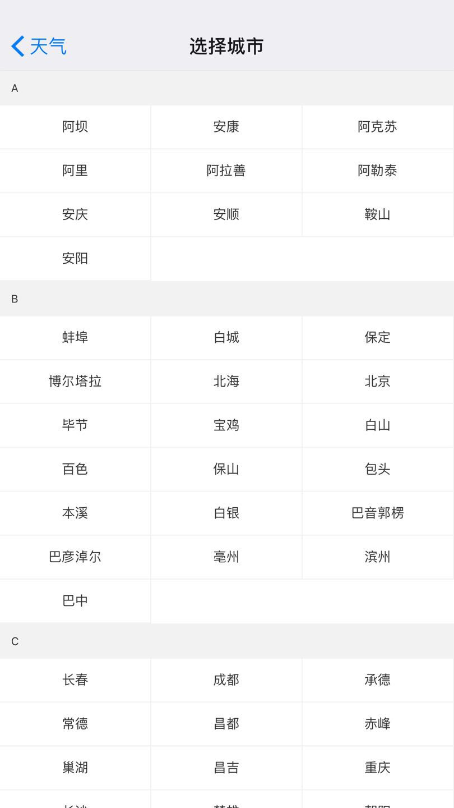
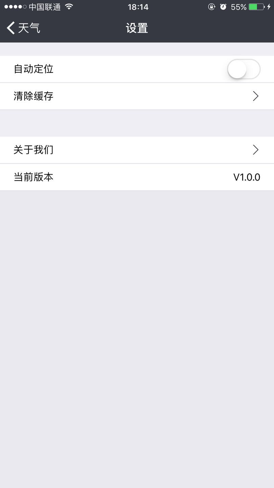

## ReactWeather

基于ReactNative的简单展示天气的应用,下图是部分在iphone上运行效果，后续再Android上的运行效果会后续补充。

|  |  |  |
| ---------------------------------------- | ---------------------------------------- | ---------------------------------------- |
|  |  |  |

## Inspiration

作为一个android开发者，一直对ReactNative开发有一定的兴趣，趁着刚好有时间，学习了一下reactnative开发。一般在学习一个平台的应用开发时，总是习惯开发一个天气应用，于是便有了这个ReactWeather应用。该应用只是简单地实现了天气展示功能，并没有做太多的其他功能，有些功能还在开发当中，有时间会继续开发。

## Framework

* 虽说也学习了redux架构，但是觉得redux比较笨重，因而采用了比较轻便的[Mobx](https://github.com/mobxjs/mobx)架构，后续会学习[dva](https://github.com/dvajs/dva)架构，据说会更好用
* 导航运用了[ReactNavigation](https://github.com/react-community/react-navigation)，由于官方推荐使用此框架，于是学习了一下，的确方便好用
* 侧边栏使用了[react-native-drawer-layout](https://github.com/react-native-community/react-native-drawer-layout),同时支持Android和IOS平台，用法和AndroidDrawerLayout一样
* 项目主要是天气展示部分分得比较细致，其他部分由于还没有完工，所以会慢慢补充并且重构
* 城市选择运用了[react-native-city-select](https://github.com/ryanyu104/react-native-city-select),比较好的一个已经实现的城市选择界面
* 数据持久化运用了[react-native-storage](https://github.com/sunnylqm/react-native-storage)，考虑到这个应用并比较轻型，所以没有选择使用slqite数据库，只是做了一些缓存的记录和城市的存储
* 图标主要采用了[react-native-vector-icons](https://github.com/oblador/react-native-vector-icons),这个库很好用，基本上两个平台上主流的矢量图标都存在
* 滑动删除使用了[react-native-swipeout](https://github.com/dancormier/react-native-swipeout),这是一个在RN平台上实现比较好的滑动删除库
* 默认使用了RN自己实现的定位功能

## API

* 天气api使用了和风天气提供的免费接口
* 壁纸采用了[bing壁纸](https://github.com/xCss/bing)，这是一个哥们自己实现的bing壁纸接口，后续会完善这个接口，让app能够显示更多的壁纸

## Progress

### Finished

* [x] 实现了定位功能
* [x] 实现了每日壁纸自动更新
* [x] 实现了下拉刷新天气
* [x] 实现了添加城市
* [x] 实现了滑动删除城市
* [x] 实现语音播报天气

### To do

- [ ] 适配好Android平台
- [ ] 现基于Realm的数据持久化
- [ ] 实现动态背景或者天气壁纸的动态更换
- [ ] 实现语音播报天气和图表显示天气信息
- [ ] 现语音播报天气
- [ ] 实现分享天气功能以及推送功能
- [ ] 暂时还没想粗来,走一步看一步吧。。。

## Clone & install

- Clone this repo `git clone git@github.com:nickming/ReactWeather.git`
- `cd ReactWeather`
- run `npm install`

## IOS & ANDROID

在根目录执行react-native run-ios 或者react-native run-android

## License

Released under the [MIT License](http://opensource.org/licenses/MIT).

## Feedback

欢迎反馈，欢迎issue和star

